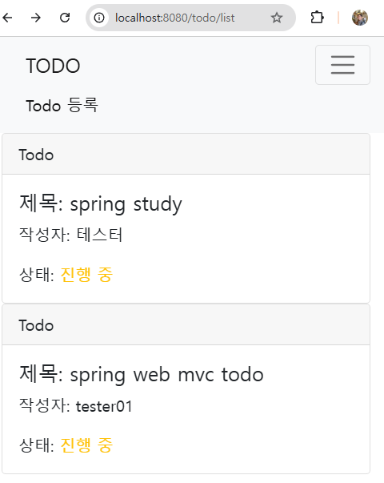
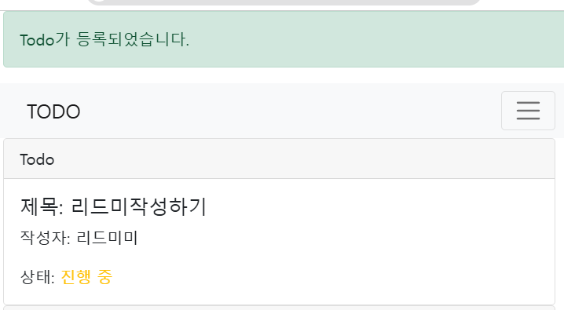
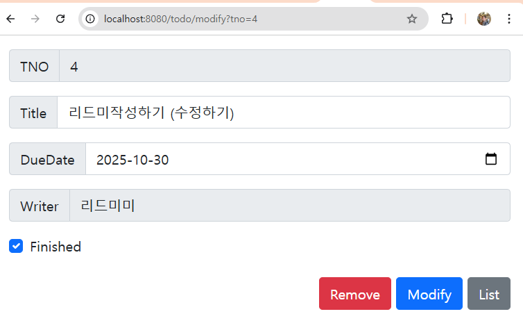
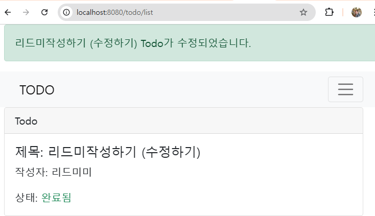
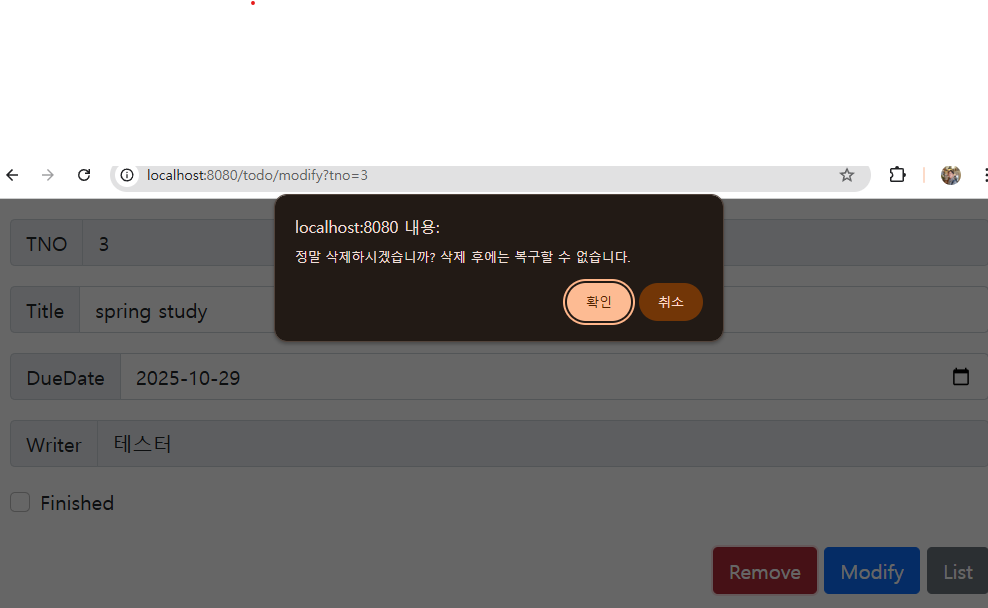
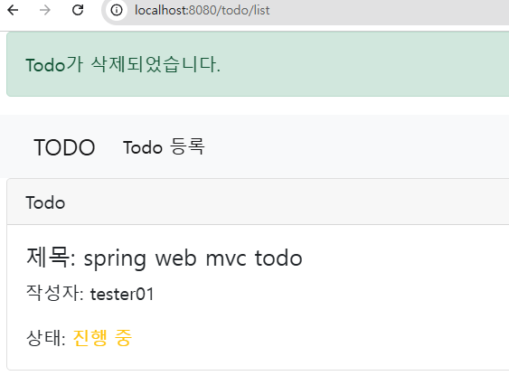

# Spring Web MVC 기반 TODO CRUD 
> 프로젝트 목적
- Spring WebMVC 구조 설계 및 설정 연습
- TODO CRUD 로직 구현 연습
- JSP, BootStrap5 를 통한 웹 페이지 구현 연습

## 📦기술 스택
- Java 8
- Spring Web MVC
- MyBatis
- JSP
- Bootstrap 5
- Log4j2
- Lombok
- Gradle

## 📁프로젝트 구조
```
src/main/java/com/ssg/todoservice/
├── config/
│   └── ModelMapperConfig.java # 설정 클래스 (예: ModelMapper 설정)
├── controller/
│   ├── TodoController.java    # 컨트롤러 계층
│   └── formatter/             # 사용자 입력 포맷터
│       ├── CheckboxFormatter.java
│       └── LocalDateFormatter.java
├── domain/                    # 도메인 객체 (Getter only)
│   └── TodoVO.java
├── dto/                       # 데이터 전송 객체 (계층간 데이터 전송목적)
│   └── TodoDTO.java
├── mapper/                    # MyBatis 매퍼 인터페이스
│   └── TodoMapper.java
├── service/                   # 서비스 계층
│   ├── TodoService.java  
│   └── TodoServiceImpl.java
└── lombok.config              # Lombok 설정 파일


src/main/resources/
├── log4j2.xml                 # 로깅 설정
├── mappers/                   # MyBatis XML 매퍼
│   └── TodoMapper.xml
└── static/                    # 정적 리소스

src/main/webapp/
└── WEB-INF/
    ├── web.xml                # 웹 애플리케이션 설정
    ├── spring/                # Spring 설정 파일
    │   ├── root-context.xml
    │   └── servlet-context.xml
    └── views/                 # JSP 뷰
        ├── custom404.jsp
        └── todo/
            ├── list.jsp
            ├── modify.jsp
            ├── read.jsp
            └── register.jsp

src/test/                      # 단위 테스트
├── java/com/ssg/todoservice/mapper/
│   └── MapperTests.java      
└── resources/
```

## 📌주요 기능
- ✅ Todo 목록 조회
- ✅ Todo 등록
- ✅ Todo 상세 조회
- ✅ Todo 수정
- ✅ Todo 삭제

## 📄구현 결과
### Todo list 조회


### Todo 등록



### Todo 수정



### Todo삭제



## 🔧 주요 구현 코드

### 1. ✅ TodoController.java – 등록/수정/삭제 흐름
- @PostMapping, @PostMapping("/modify"), @GetMapping({"/read", "/modify"})
  , @PostMapping("/remove")
- DTO를 받아서 서비스로 넘기고, 리다이렉트 처리
```java
/** 등록 처리 */
  @PostMapping
  public String register(
      @ModelAttribute("todo") @Valid TodoDTO todo,
      BindingResult bindingResult,
      RedirectAttributes rttr
  ) {
    if (bindingResult.hasErrors()) {
      return "register";
    }

    try {
      todoService.register(todo);
    } catch (DuplicateKeyException e) {
      // PK(mid) 중복 시 폼으로 되돌리기
      bindingResult.rejectValue("tno", "duplicate", "이미 등록된 Todo입니다.");
      return "register";
    }

    rttr.addFlashAttribute("msg", "Todo가 등록되었습니다.");
    return "redirect:/todo/list";
  }
  
/** 수정 처리 */
@PostMapping("/modify")
public String modify(@Valid TodoDTO todoDTO,
    BindingResult bindingResult,
    RedirectAttributes redirectAttributes) {
  if (bindingResult.hasErrors()) {
    log.info("has errors.......");
    redirectAttributes.addFlashAttribute("errors", bindingResult.getAllErrors());
    redirectAttributes.addAttribute("tno", todoDTO.getTno());
    return "redirect:/todo/modify";
  }
  todoService.modify(todoDTO);
  redirectAttributes.addFlashAttribute("msg", todoDTO.getTitle() + " Todo가 수정되었습니다.");
  return "redirect:/todo/list";
}

/** 상세 조회 (읽기, 수정) */
@GetMapping({"/read", "/modify"})
public void read(Long tno, Model model) {
  TodoDTO dto = todoService.getOne(tno);
  log.info(dto);
  model.addAttribute("dto", dto);
}

/** 삭제 */
@PostMapping("/remove")
public String remove(Long tno, RedirectAttributes redirectAttributes) {
  log.info("-------------remove------------------");
  todoService.remove(tno);
  redirectAttributes.addFlashAttribute("msg", "Todo가 삭제되었습니다.");
  return "redirect:/todo/list";
}
```

### 2. ✅ TodoServiceImpl.java – ModelMapper 활용
- DTO → VO 변환 후 DB 처리하는 로직
- ModelMapper를 통해 계층 간 변환을 간결하게 처리
```java
  @Override
  public void register(TodoDTO todoDTO) {
    TodoVO todoVO = modelMapper.map(todoDTO, TodoVO.class);
    todoMapper.insert(todoVO);
  }

  @Override
  public List<TodoDTO> listTodos() {
    List<TodoVO> voList = todoMapper.findAll();
    return voList.stream().map(vo -> modelMapper.map(vo, TodoDTO.class)).collect(Collectors.toList());
  }

  @Override
  public TodoDTO getOne(Long tno) {
    return modelMapper.map(todoMapper.findById(tno), TodoDTO.class);
  }

  @Override
  public void remove(Long tno) {
    todoMapper.delete(tno);
  }

  @Override
  public void modify(TodoDTO todoDTO) {
    TodoVO todoVO = modelMapper.map(todoDTO, TodoVO.class);
    todoMapper.update(todoVO);
  }
```

### 3. ✅ TodoMapper.xml – MyBatis SQL 매핑
- VO를 통해 데이터 지정
- insert, select, update, delete 등
- LocalDate 매핑 시 타입 핸들러 사용
```xml
<!--  받고자하는 데이터 지정-->
  <resultMap id="TodoResultMap" type="com.ssg.todoservice.domain.TodoVO">
    <id property="tno"    column="tno"/>
    <result property="title"   column="title"/>
    <result property="dueDate"  column="dueDate" jdbcType="DATE" javaType="java.time.LocalDate"/>
    <result property="finished"  column="finished" />
    <result property="writer"  column="writer" />

  </resultMap>

  <!-- java.time.LocalDate 매핑 : JSR-310 타입 핸들러 이용-->
  <insert id="insert" parameterType="com.ssg.todoservice.domain.TodoVO">
    INSERT INTO tbl_todo (title, dueDate, finished, writer)
    VALUES (#{title},
    #{dueDate, jdbcType=DATE, javaType=java.time.LocalDate},
    #{finished}, #{writer})
  </insert>

  <select id="findAll" resultMap="TodoResultMap">
    SELECT tno, title, dueDate, finished, writer
    FROM tbl_todo
    ORDER BY tno DESC
  </select>
```

### 4. ✅ CheckboxFormatter.java – 사용자 입력 포맷터
- HTML checkbox 값을 boolean으로 변환하는 커스텀 포맷터

```java
@Override
public Boolean parse(String text, Locale locale) {
  return text != null && text.equals("on");
}
```

### 5. ✅ list.jsp – 목록 출력 JSP
- JSTL을 활용한 조건, 반복 출력, 완료 여부 표시 등

```html
<c:if test="${not empty msg}">
  <div class="alert alert-success">${msg}</div>
</c:if>

<c:forEach var="todo" items="${todos}">
  <a href="/todo/read?tno=${todo.tno}" style="text-decoration: none; color: inherit;">
    <div class="card">
      <div class="card-header">
        Todo
      </div>
      <div class="card-body">
        <h5 class="card-title">제목: ${todo.title}</h5>
        <p class="card-text">작성자: ${todo.writer}</p>
        <p class="card-text">
          상태: <span class="${todo.finished ? 'text-success' : 'text-warning'}">
          ${todo.finished ? '완료됨' : '진행 중'}</span>
        </p>
      </div>
    </div>
  </a>
</c:forEach>

    


```


### 6. ✅ ModelMapperConfig.java – 설정 클래스
- ModelMapper를 Bean으로 등록해 DTO ↔ VO 변환을 자동화
```java
@Configuration // 해당 클래스가 스프링 빈에 대한 설정을 하는 클래스임을 표기 및 스프링 빈에 등록
public class ModelMapperConfig {

  @Bean // 해당 메소드의 실행 결과로 반환된 객체를 스프링의 빈으로 등록하는 역할
  public ModelMapper get() {
    ModelMapper modelMapper = new ModelMapper();
    modelMapper.getConfiguration()
        .setFieldMatchingEnabled(true) // 필드 이름 기반 매핑 활성화 (getter/setter 없이도 매핑 가능)
        .setFieldAccessLevel(org.modelmapper.config.Configuration.AccessLevel.PRIVATE) // private 필드 접근 허용 (리플렉션 기반)
        .setMatchingStrategy(MatchingStrategies.LOOSE) // 이름이 비슷하면 매핑 시도 (실수 유발 가능)
        .setAmbiguityIgnored(true) // 모호한 매핑 무시 (매핑 충돌 시 예외 방지)
        .setSkipNullEnabled(true); // null 값은 매핑에서 제외 (기존 값 유지)
    return modelMapper;
  }
}
```